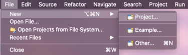
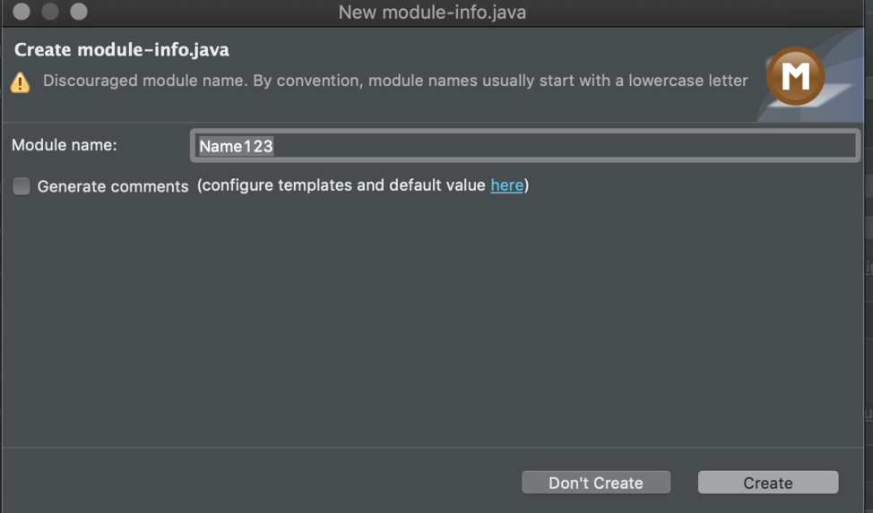
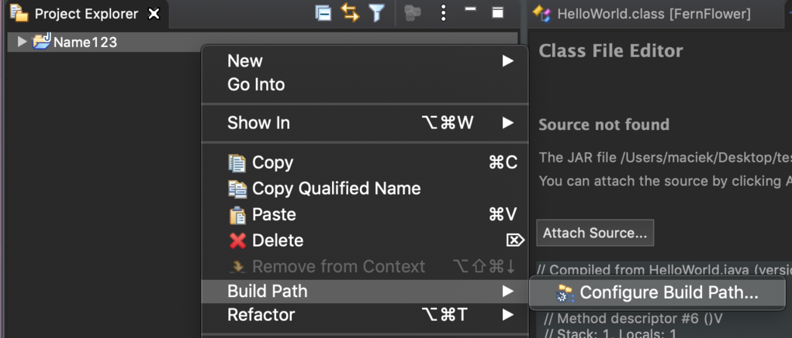

This tutorial is fast break into decompiling and debugging JAR files in Eclipse. Inspired by mr_me
[Busting Cisco's Beans :: Hardcoding Your Way to Hell](https://srcincite.io/blog/2020/01/14/busting-ciscos-beans-hardcoding-your-way-to-hell.html)

1. Install Eclipse https://www.eclipse.org/downloads/
2. Install Enhanced Class Decompiler from eclipse marketplace https://marketplace.eclipse.org/content/enhanced-class-decompiler
3. Configure Enhanced Class Decompiler https://ecd-plugin.github.io/ecd/
4. Open a new project
 
5. Create a Java project
 
6. Type in Project name (in this case _Name123_) and click _Finish_

7. Just don't create module (click _Don't create_)

8. Right click on the name of the project -> _Build path_ -> _Configure build path..._

9. Add external JARs

10. Choose file from localsystem & click _Open_
You can use this easy example:  
[Helloworld_if.jar](Helloworld_if.jar)

11.  Select _Apply and Close_
12.  Just doubleclick on *.class file in Project Explore!

13. We can start debugging by rightclick on *.jar and _Debug as_

14. Here we are! _Step into_/_Step over_ and have fun
